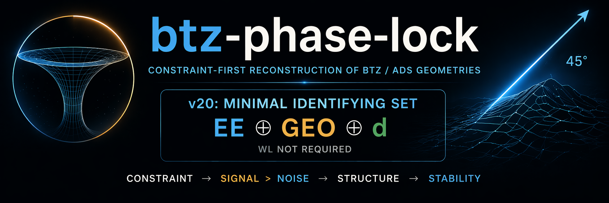
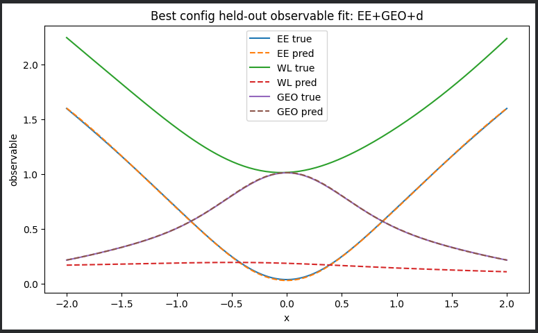
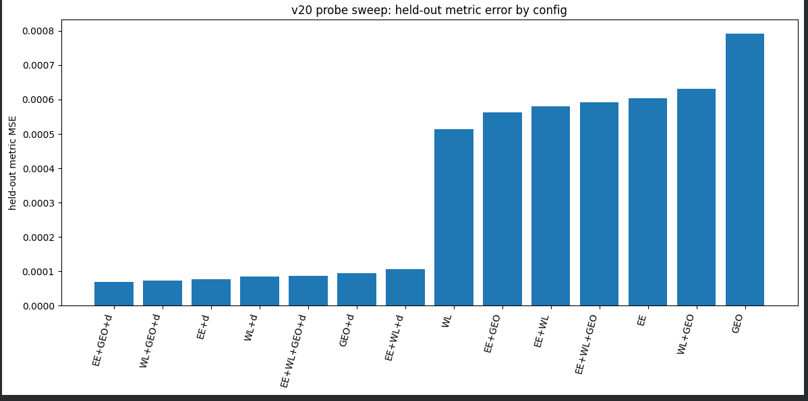
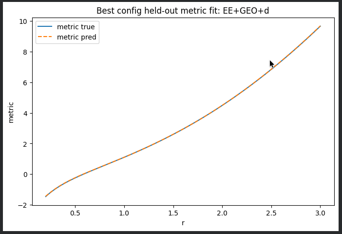
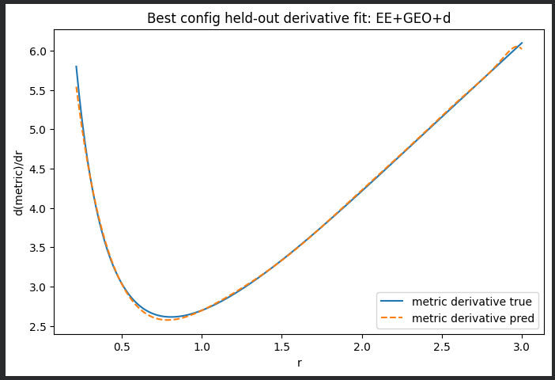
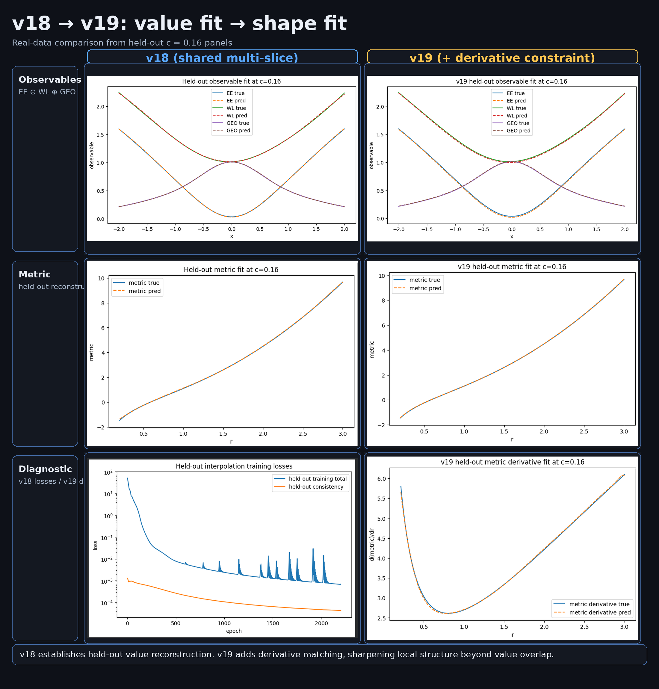
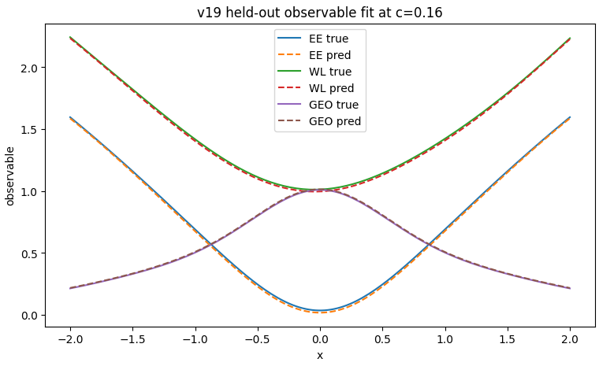
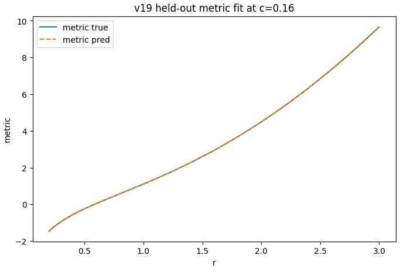
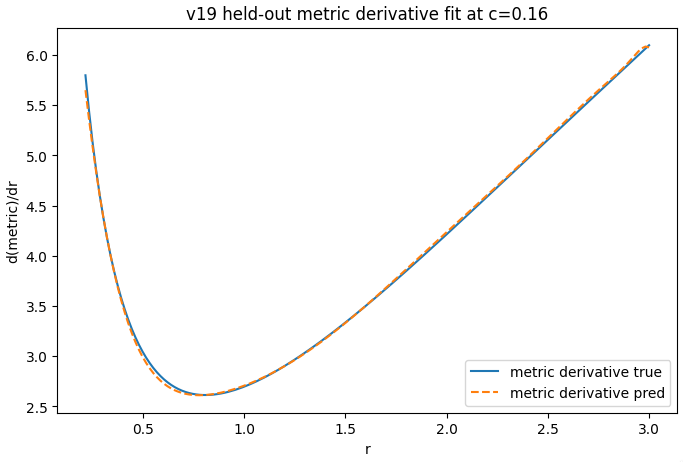

<h1 align="center">
  minimal identifying set → EE ⊕ GEO ⊕ derivative (WL not required)
</h1>

  

<h1 align="center">btz-phase-lock</h1>

  constraint → signal > noise → structure

---

Minimal constraint-first reconstruction experiments for BTZ / AdS geometries using neural surrogates.

Core idea:  
multiple probes (EE ⊕ WL ⊕ GEO)  
→ constrain geometry  
→ signal > noise  

45° 📐

---

## 🚀 Start Here

### v20 — Probe Sweep (Minimal Identifying Set)

Probe sweep across subsets of (EE, WL, GEO) with optional derivative constraint.

---

## 🔬 v20 Result — Minimal Identifying Set

  
  

  value fit vs shape fit across probe sets 
  + metric error comparison

  
  
  

  <b>Best config:</b> EE ⊕ GEO ⊕ derivative 
   
  observables ✔ &nbsp;&nbsp; metric ✔ &nbsp;&nbsp; derivative ✔  
   
  → minimal set ≠ full probe set  
   
  → WL not required for optimal reconstruction

---

## 🧠 Interpretation (v20)

- derivative constraint is **necessary** for structure  
- GEO provides **geometric anchoring**  
- WL is **redundant** under this setup  

→ minimal identifying set:

<b>EE ⊕ GEO ⊕ derivative</b>

---

## 🔬 Minimal separating probe: values → structure

<h2>🔬 v18 → v19: value fit → shape fit</h2>

  

  v18: value fit (observables + metric) 
  v19: structure fit (adds derivative constraint) 
   
  bottom row contrast: 
  v18 → optimization signal (loss) 
  v19 → geometric signal (derivative)

---

<h2>📊 Results (v19 detail)</h2>

<b>Held-out test:</b> 
train on c = 0.00, 0.30 → predict c = 0.16

  
  
  

  <b>Observables</b> — EE ⊕ WL ⊕ GEO align 
  <b>Metric</b> — geometry recovers 
  <b>Derivative</b> — slope matches (new)

  observables ✔ &nbsp;&nbsp; metric ✔ &nbsp;&nbsp; derivative ✔  
   
  → value fit → shape fit  
   
  → ambiguity reduced under minimal constraint

---

### v18.1 — Multi-Slice Discriminator

---

### v17 — Indistinguishable Solutions

---

### v14–v16 — Branching → Dual Solutions → Probe Fit

- v14: branching appears  
- v15: dual/global solutions  
- v16: probe fitting improves alignment  

[Open repo notebooks](https://github.com/thinkthoughts/btz-phase-lock)

---

## 🧠 Progression

single probe → partial  

EE ⊕ WL → better  

EE ⊕ WL ⊕ GEO → stable reconstruction  

v17 → indistinguishable branches  

v18 → multi-slice reduces ambiguity  

v19 → derivative constraint matches slope (structure)  

v20 → minimal identifying set (EE ⊕ GEO ⊕ d)  

---

## 🧭 Roadmap

- v19 → derivative constraint (structure)  
- v20 → minimal identifying set (EE ⊕ GEO ⊕ d)  
- v21 → robustness (noise / seeds / slices)  

---

## ⚙️ Notes

- synthetic targets (demo-level)
- minimal MLP (tanh)
- constraint-first, not architecture-first

---

## 🌿

constraint → signal > noise  
structure → stability  

45° 📐
